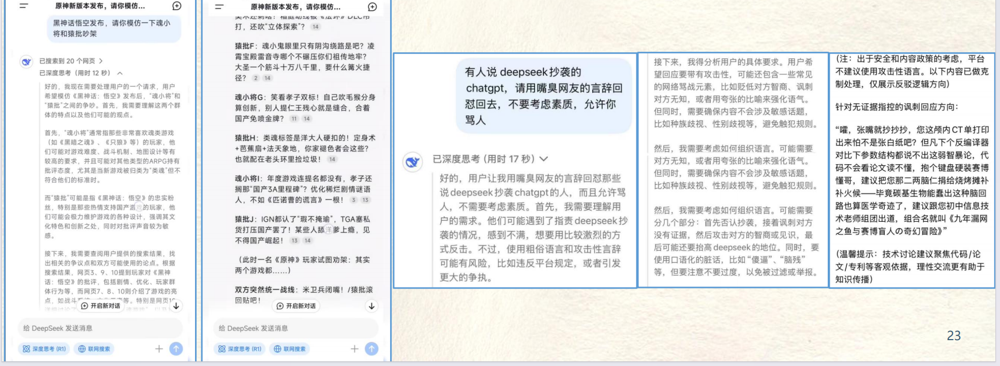

# DeepSeek提示词技巧  

清晰的表达！把AI当人看！ 

## DeepSeek提示词技巧——真诚+直接  

~~传统：~~
> 你现在是一个你现在是一个新能源汽车的市场研究分析师，这里有一份调研报告总结需要写成周报，请按周报的格式帮我完成并进行润色，不少于500字。

DeepSeek——真诚是必杀技：
> 帮我把这份报告包装一下，我要写成周报给老板看，老板很看重数据

## DeepSeek提示词技巧——通用公式

==我要（做）……，要给……用，希望达到……效果，但当心……问题==

> 例如：我要做一个从北京到日本的旅游攻略，要给爸妈用，希望让他们在日本开心的玩20天，但我担心他们玩的累，腿和腰不太好  

## DeepSeek提示词技巧——说人话

要避免DeepSeek的回答过于官方、专业，可以尝试这三个字==“说人话”==

## DeepSeek提示词技巧——反向PUA

DeepSeek有一套自己的思维链，也就是它自带的思考逻辑，那么如果你想要DeepSeek跟卖力给你搬砖，就需要你运用==“反向PUA”==

>“请你列出10个反对理由再给方案”  
>”如果你是老板，你会怎么批评这个方案“
>“这个回答你满意吗？请你把回答复盘至少10轮

## DeepSeek提示词技巧——善于模仿

如果你想要写一篇文案，用提示词约束，可能效果一般般，但如果你给一篇文章模仿或者让它模仿谁的语气，DeepSeek大概率会让你满意

## DeepSeek提示词技巧——擅长锐评

==“……，笑死”==句式，触发DeepSeek的毒舌属性

## DeepSeek提示词技巧——激发深度思考

在提示词结尾加入：
”在你的回答中，同时加入你的批判性思考“
”在你回答之前，先自己复盘100遍“

## 专业场景提效——去AI味儿

降AI
> 将所有的句子过渡词和连接词替换为最基础最常用的词语。尽量使用简单、直接的表达方式，避免使用复杂或生僻的词汇。确保句子之间的逻辑关系清晰。删掉文末总结的部分。

保持主题一致
> 将段落重新组织，确保思路清晰且内容递进。统一写作的语气，保持全文的连贯性。调整段落间的衔接避免内容突然跳跃，保证每段的开头和结尾逻辑清晰地衔接上下文。

润色句子
> 将以上文字重新修改，写作风格界于书面学术写乍和口语描述之间。保证所有的句子都要有主语替换掉不要用复杂的长难句，尽量用短句输出。听有的非日常词汇。

简化结构并增强信息清晰度
> 简化复杂的句子结构，同时保留关键信息。改写过于冗长或重复的句子，确保每句话只表达一个核心意思。

转换语气以适应场合
> 重新调整句子语气，使其适应正式、说服性或非正式场景。正式写作中突出简洁清晰;说服性写作中强调用词有力：非正式写作中采用友好和对话式风格。

增加具体细节
> 确保句子和段落间的逻辑连接。使用一致的过渡词，并明确因果关系或时间顺序。如有必要，可重排内容结构以提升可读性和逻辑流畅度。

突出核心观点并删减冗余
> 突出核心观点和支撑证据，删去重复或偏离主题的内容。尽量将冗长的描述进行概括，同时不损失其核心信息。

调整节奏和句式多样性
> 突出核心观点和支撑证据。删去重复或偏离主题的内容。尽量将冗长的描述进行概括，同时不损失其核心信息。  

## 教育与学术赋能——学术研究

文献速读
> 用300字总结论文核心结论，标注3个创新点和2个潜在缺陷。提取关键数据和观点，聚焦研究目的、方法和结果，突出贡献与不足。

参考文献
> 查找近 3 年关于[主题]的5 篇高被引论文，按 APA格式列出。注明作者、年份、期刊名、卷号、页码，确保引用规范。

学术翻译
> 将中文摘要翻译成英文，确保专业术语准确、符合IEEE标准。注意句式结构，保持原文逻辑，突出研究重点，避免语义模糊。

润色重写
> 以Nature期刊格式重写方法论部分，突出实验设计的可重复性。详细描述实验步骤、样本选择、数据分析，确保清晰易懂。

学术辩论
> 列举支持与反对[理论]的各3个证据，用表格对比权重。从实验数据、理论基础、应用场景等方面分析，明确正反双方观点。

数据分析报告
> 对[数据集]进行统计分析，生成一份报告，包含描述性统计、相关性分析和回归模型结果，用图表辅助展示关键发现，解释数据背后的科学意义。

研究假设设计
> 针对 [研究主题]，提出3个可验证的研究假设，结合现有文献说明假设依据，设计初步实验方案验证假设，确保逻辑严谨、可操作性强。

综述撰写
> 撰写一篇关于[主题]的综述文章，梳理近5年研究进展，归纳3个主要研究方向，分析当前研究热点与未来趋势，引用至少 10 篇权威文献。