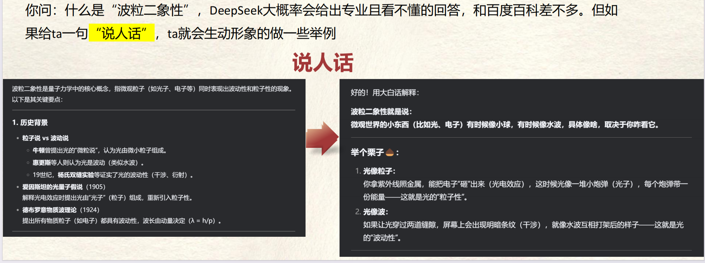

# DeepSeek提示词技巧  

清晰的表达！把AI当人看！ 

## DeepSeek提示词技巧——真诚+直接  

~~传统：~~
> 你现在是一个你现在是一个新能源汽车的市场研究分析师，这里有一份调研报告总结需要写成周报，请按周报的格式帮我完成并进行润色，不少于500字。

DeepSeek——真诚是必杀技：
> 帮我把这份报告包装一下，我要写成周报给老板看，老板很看重数据

## DeepSeek提示词技巧——通用公式

==我要（做）……，要给……用，希望达到……效果，但当心……问题==

> 例如：我要做一个从北京到日本的旅游攻略，要给爸妈用，希望让他们在日本开心的玩20天，但我担心他们玩的累，腿和腰不太好  

## DeepSeek提示词技巧——说人话

要避免DeepSeek的回答过于官方、专业，可以尝试这三个字==“说人话”==

## DeepSeek提示词技巧——反向PUA

DeepSeek有一套自己的思维链，也就是它自带的思考逻辑，那么