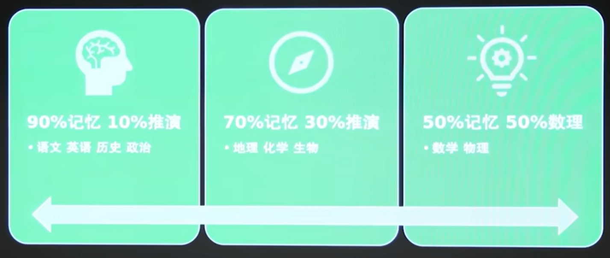
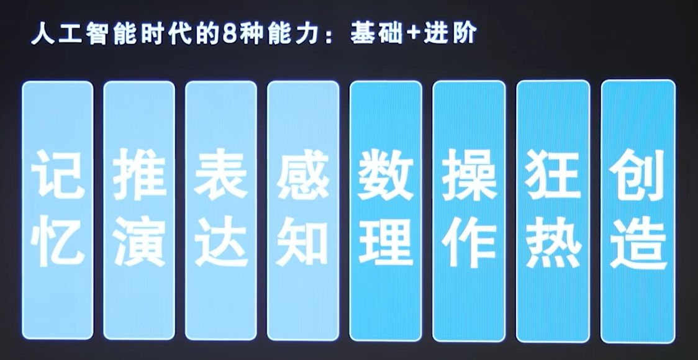

---
tags:
  - 教育
---
# 越过"废人陷阱"——AI时代，教育将如何被改写？

> 讲座笔记[【越过废人陷阱：AI时代，教育将被如何改写？  沈辛成  |【老师在B站】02】 ](https://www.bilibili.com/video/BV1yRA7zJE1k/?share_source=copy_web&vd_source=783a3f9c63a4e1c518117920c825f547)，2026-04-24

---

## 一、标准化考试：一场精心设计的筛选机制

### 什么是标准化考试？

按照统一、科学的规则来出题、考试、评分和解释分数，以确保对所有考生公平、结果可靠的一种考试形式。核心目的是**保障大规模选拔中的公平性**——大规模意味着资源分配问题，意味着必须用一套通用标准来衡量所有人。

标准化考试只测三种能力：记忆、推理、数理。

这套体系存在的根本原因，是为了在人群中**挑选少数数理能力强的人**。

### 筛选，而非培养

> 以标准化考试为目的的教育，**不是**为了培养人，而是为了**筛选**人。这个过程在中考时就已经完成。

一个证据：衡水中学清北录取人数，在生源掐尖政策限制后骤降——2019年275人 → 2025年仅45人。顶级人才在中考阶段已完成分流，高中教育实际上是筛选结果的再确认，而非真正的能力塑造。

---

## 二、教育的口号异化：说得漂亮，做得空洞

以学生为中心、创新人才培养、批判性思维、素质教育……这些概念人人熟悉，却只停留在口号层面。多数人反复听闻、背诵名词，但根本说不清具体内涵、落地方式。

这类看似正确、表意模糊、无法落地的流行术语大规模泛滥，本质原因是：**传播学异化为营销学**。

| | 真正的传播学 | 异化后的营销式传播 |
|---|---|---|
| 目的 | 基于有效信息传递 | 制造好听的概念、宏大的话术 |
| 结果 | 双向沟通、传递实质内容 | 只追求听起来合理，回避具体定义 |

**教育口号的真实含义：**

- "以学生为中心" → 以能力配置**符合考试要求**的学生为中心
- "创新人才培养" → 数理+推演+操作 → 工科生/理科生
- "批判性思维" → 明明是记忆>>推演，少数批判也是背的
- "素质教育" → 不具备适考性的能力，无法融入标准化考试

换句话说，标准化教育评价体系之外的一切能力，都被系统性地忽略了。

**被忽视的八大能力：**

- **记忆**：思维的起点
- **推演**：厘清复杂事物背后的关联，判断真伪，得出规律，预演结果
- **表达**：将信息、情感、思想以具有感染力的方式传递出去
- **感知**：通过五感接收、选择、整合并解读外界信息
- **数理**：高纯度的抽象思维，掌握数学、物理等学科思维
- **操作**：制造和使用工具
- **狂热**：极致的热爱、强烈的目标感、抗压意志力、长期深耕的专注力
- **创造**：行为主义鉴别原则——"无中生有"的能力

---

## 三、标准化考试为何难以撼动？

**高考公平性的逻辑：**

- **编织大网的必要性**：数理能力在宏观层面极其重要，而能力者分布是随机的，必须大网打捞
- **编织大网的可能性**："三件套（记忆、推理、数理）"具备高适考性——鉴别成本低，覆盖范围广

高考的"公平性"在于**无视阶级**，但并非无视能力差异。

> 学生疲于应付，不是唯分数论导致的。是**唯分数论还没整明白，就开始折腾别的**导致的。

**"高考三件套"稀缺性下降，为何依然不变：**

- **必然性1（最大公约数）**：人群中最普遍能接受的标准 = 最没有棱角、最缺乏观点的标准
- **必然性2（异化）**：教育为教育体系自身服务，既不对学生负责，也不对知识负责
- 教育从来都是变革中最慢的一环

更关键的是：当前基础教育"联合体"对AI的力量知之甚浅。

---

## 四、回归教育本质

> 教育是帮助人获得**未来能够用得上的技能**。所以首先要考察的是**技能的有用性**，而非传授的方法和形式。

在AI冲击下，技能的有用性难以预测。建制化的教育只有**适度后撤**，才能实现个人化的灵活部署。

---

## 五、AI如何改写教育

**核心思路：优化标准化考试，降低应试的时间比重。**

- 不考过度记忆
- 文意推演往清晰里考
- 数理往学科思维上考

**教育范式的大转向：**

| 旧范式 | 新范式 |
|---|---|
| 知识灌输 | **问题发现** |
| 个人竞争 | **人机协作** |
| 标准化评估 | **个性化成长** |
| 课堂学习 | **社会实践** |

---

## 六、真正的"废人陷阱"

### 问题根源：不是人不行，是标准太单一

数理薄弱成为普遍困境，仅是近百年的特有现象，在漫长人类文明中从未存在。**问题根源并非人本身，而是单一化的评价标准**，以及支撑这套标准的社会体系。

### 教育的真正误区

优质教育的内核早已被前人定义。当下教育的误区不在于储备不足、跟不上AI时代，而在于**过度内卷、无效内耗**。

### 破局关键

做减法、认清自我，跳出标准化的"废人陷阱"，主动清醒，重构自我成长与教育的认知。

> "大学生社会化"这个说法本身就有问题——像是在把年轻人当成家畜一样驯化。
>
> 社会化教育的核心逻辑很简单：**凡是写不进课本里的东西，恰恰都是最值得学的东西。**

---

## 七、职业安全：不要正面硬刚AI

**两种护城河：**

- **性价比护城河**：只要AI部署成本 > 用人成本，人就有岗位空间
- **神秘感护城河**：行业在大众眼里越"神秘/神圣"，竞争越不充分，岗位越稳（如教师、医生、神职类）

> 不要在计算、记忆、推演上与AI正面竞争。要靠**成本结构 + 行业叙事/神秘感**保住饭碗。

---

## 八、正在发生的变革：学制压缩与社会化前移

义务教育阶段已出现**学制压缩的趋势**——学生需要更早建立自主意识、提前完成社会化，而不是拖到大四、研究生、博士阶段，才被迫接触社会、适应现实。

随之而来的问题：初中生、高中生在现有学校规则与应试框架的束缚下，要如何自主推进社会化成长？

### 变革一：新型教育机构打破传统学制

已出现这类办学模式：直接取消高中、本科学制，把原本七年的学习周期压缩为五年。

课程完全重构，以计算机为核心，搭配少量物理、生物与文科内容，砍掉冗余的英语等应试科目。背后由大厂扶持，学习全程对接产业实践，毕业直接定向就业。

这种模式本质是复刻过去的中专逻辑：不拼虚无的学历内卷，全程落地实操、就业定向。在早年，实操导向的中专远比不确定性强的高中更吃香。

### 变革二：学制缩短已成高层共识

大量初高中时间消耗在重复刷题、应试技巧训练上，实际成长价值极低。教育界已形成共识：**缩短初高中学制、砍掉无效刷题年份**。

缩短学制的多重现实意义：

1. 淘汰无意义的应试内耗，减少标准化内卷
2. 学生更早进入大学阶段，身心状态匹配婚恋、建立亲密关系的合理周期
3. 跳出庞大固化的传统教育体系束缚，更早自主探索、完成社会化

> 拉长历史来看，学制调整、分流教育、实操导向办学，都是反复出现过的模式。当下的教育改革，只是在复刻过往被验证过的路径，重新找回更贴合社会需求、贴合人成长规律的教育形态。

---

## 九、核心结论

1. **高考筛选逻辑有效、刚需且不可替代**，弊病是冗余内耗，而非整体崩坏
2. 所有规模化教育都离不开标准化考试，海外路线无例外
3. 拒绝极端对立思维，不把制度妖魔化、不幻想推翻一切就能解脱
4. 教育体系依托现实协作需求存在，具备强稳定性，短期不会消亡
5. **最优解：接纳规则、适配自我、降低内耗**；人的困境往往源于内在执念，而非外部环境
6. 时代核心差距：表层是财富，**底层是认知**，而认知差距往往由经济条件决定
