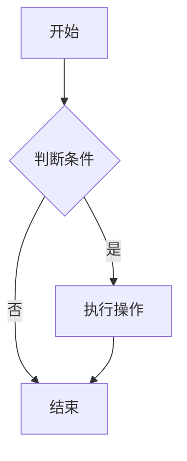

# 我的第一个Markdown

> **免责声明**
>
> 1. **创作方式说明**：本文内容在整理时使用了 AI 工具辅助生成草稿，但所有技术要点均经过本人实际操作环境下的验证与编辑，不代表 AI 的原始输出。
> 2. **准确性与时效性**：Markdown 语法可能会随着解析器或平台更新而变化，本文无法保证所有语法在您当前使用环境下完全一致，请以官方文档或实际测试为准。
> 3. **非专业建议**：本文仅为个人学习记录，不构成任何形式的技术指导或职业建议。因参考本文而导致的格式错误、兼容性问题或其他损失，作者不承担责任。
> 4. **第三方链接与商标**：文中出现的网站链接（如 B站、GitHub）仅作为语法示例，不代表推荐或认可其全部内容。所有商标和品牌归各自权利人所有。
> 5. **版权与转载**：本文由本人原创整理，如果您觉得有用欢迎带链接分享，禁止未经授权的商业使用。

---

这是我学习 Markdown 的开始，以下是我认为实用的知识点总结。

部分语法效果可能难以直接体现，建议移步至 [GitHub](https://github.com/BaiDuRen69/Markdown/blob/main/%E5%AD%A6%E4%B9%A0/Markdown%E5%9F%BA%E7%A1%80.md)查看源文件。

## 基本语法

### 标题语法

#### 使用 # 号标记

1. 使用 `#` 号表示 1~6 级标题  
   一级标题对应一个 `#`，二级标题对应两个 `#`，以此类推。
2. `#` 与标题文字之间需要有一个空格。
3. `#` 前面不能有其他字符（除非是引用块内部的缩进）。
4. 建议全文只保留一个一级标题。

### 段落语法

Markdown 段落没有特殊格式，直接书写文字即可。

#### 段落的换行

1. 使用两个及以上空格 + 回车（最常见标准）。
2. 在段落之后插入一个空行。
3. HTML 换行标签：在需要换行的位置添加 `<br>`。

> ⚠️ 注意：在 VS Code 中，若安装了 Markdown Preview Enhanced 插件，默认会勾选 “break on single new line”，导致直接回车就会换段落。建议**关闭**该选项，以贴近标准 Markdown 行为。

### 强调语法

#### 粗体

使用 `**` 包围文字：  
**这是加粗的字**

#### 斜体

使用 `*` 包围文字：  
*这是斜体文字*

#### 粗斜体组合

使用 `***` 包围文字：  
***这是粗斜体文字***

### 分隔线语法

在一行中使用三个及以上的 `*`、`_` 或 `-` 即可创建分隔线，行内不能有其他内容。

- `*` 和 `_` 之间可以夹杂任意数量空格（含0个）。
- `-` 至少需要三个，且任意两个 `-` 之间要有一个空格（总空格数 ≥ 1）。
- 为获得最佳兼容性，建议在分隔线前后各留一个空行。

---

### 删除线语法

在文字两端添加两个 `~` 即可：  
~~这是添加了删除线的文本~~

### 引用语法

在段落前添加 `>` 符号即可创建块引用。

> 这是引用

#### 多段落的块引用

空白行也需要添加 `>` 符号，以保持连续引用：

> 这是第一段
>
> 这是第二段

#### 嵌套块引用

一个 `>` 是最外层，两个 `>` 是第一层嵌套，以此类推：

> 最外层
>> 第一层嵌套
>>> 第二层嵌套

#### 引用块内的其他元素

引用块内可以包含几乎所有的 Markdown 元素（标题、列表、代码等）。

### 列表语法

#### 有序列表

数字 + 英文句点 + 空格即可：

1. 第一项  
   2. 第一小项  
      1. 第一小小项

#### 无序列表

使用 `-` + 空格：

- 第一项
  - 第一小项
    - 第一小小项

#### 列表嵌套

- 子列表需缩进 2 个空格（或 1 个 Tab）
  - 保持一致的缩进长度
    - 可以无限嵌套，但实际使用中不建议超过 3 层

#### 任务列表（复选框列表）

这是 GitHub 风格的拓展功能，部分平台可能不支持。

格式：  
`- [ ]` 未完成的任务  
`- [x]` 已完成的任务  
`1. [ ]` 有序任务列表项

示例：

> - [ ] 未完成的任务
> - [x] 已完成的任务
>
> 1. [ ] 未完成的任务
>    1. [x] 已完成的任务  

> 注意：列表标记和方括号之间要有空格，方括号内要有空格（或 x），方括号与文字之间也要有空格。

### 代码语法

行内代码使用反引号 `` ` `` 包裹：  
你看 `print`，就是这种效果。

#### 转义反引号

当行内代码本身包含反引号时，可以使用双重反引号作为包裹：

- `` 你看`printf`，就是这种效果 ``
- `` 你看``println``，也是这种效果 ``

#### 代码块

##### 缩进式代码块

使用 4 个空格或 1 个制表符缩进，并且需要与上文用空行隔开。

    这是缩进式代码块
    每一行前面都有4个空格

##### 三反引号代码块

使用 ```` ``` ```` 包裹代码，并可在开头指定语言以开启语法高亮。

常用语言标记符（不区分大小写）：

> javascript / js - JavaScript  
> python / py - Python  
> html - HTML  
> css - CSS  
> sql - SQL  
> json - JSON  
> xml - XML  
> yaml / yml - YAML  
> bash / shell - Shell 脚本  
> java - Java  
> cpp / c++ - C++  
> csharp / c# - C#  
> php - PHP  
> ruby / rb - Ruby  
> go - Go  
> rust - Rust  
> typescript / ts - TypeScript

```java
System.out.println("hello world");
```

### 链接语法

格式：`[超链接显示名](超链接地址 "可选的 title")`  
这是一个 [Markdown 教程网址](https://markdown.com.cn/)

#### 给链接增加 Title

title 是鼠标悬停时显示的文字，放在 URL 之后，用空格分隔：  
[菜鸟教程 Markdown 网址](https://www.runoob.com/markdown/ "菜鸟教程很不错，我十分感谢它的帮助")

#### 网址和 Email 地址

使用尖括号可以快速生成可点击链接：

- `<https://www.bilibili.com/>`
- `<dzb@hutb.edu.cn>`

效果：  
<https://www.bilibili.com/>  
<dzb@hutb.edu.cn>

#### 带格式化的链接

在链接语法前后添加星号即可实现强调，也可将链接文字转为代码格式：

- 斜体：*[B站番剧](https://www.bilibili.com/anime/)*
- 粗体：**[B站国创](https://www.bilibili.com/guochuang/)**
- 粗斜体：***[B站热门](https://www.bilibili.com/v/popular/all)***
- 代码链接：***[`B站电影`](https://www.bilibili.com/movie/)***

> 注意：第一个星号与前面的普通文字之间要有空格。

#### 引用类型链接

引用型链接可以让正文更整洁，适合多次复用同一 URL。

**第一部分（正文内）**：`[显示文本][标签]`

**第二部分（文档任意处）**：

```
[标签]: URL "可选的 title"
```

示例：

正文：
- [B站][1]

定义（通常放在文末）：
[1]: https://www.bilibili.com/

**简化写法**：当标签与显示文本相同时，可以省略第二对方括号：  
我喜欢用 [github][] 来管理代码。

[github]: https://github.com

#### 锚点链接

锚点链接用于文档内跳转，非常适合制作目录。  
标题会自动生成锚点，一般规则为：转为小写、空格替换为连字符、移除大部分标点。

示例：  
[回到开头](#我的第一个markdown)

### 图片语法

#### 本地图片

格式：``  
相对路径请使用正斜杠 `/`

``


#### 网络图片

直接将相对路径替换为图片 URL 即可：


也可以使用引用型链接：

这是 App Store 上的 [B站图标][2]

[2]: https://is1-ssl.mzstatic.com/image/thumb/PurpleSource211/v4/2f/1b/44/2f1b4404-bd84-ecf7-b58a-26345e7b99ec/Placeholder.mill/400x400bb-75.webp

> 提示：网络图片请确保链接稳定、注意版权，并建议重要图片本地备份。

#### 图片 alt 文本的重要性

alt 文本在图片无法显示时提供替代信息，对无障碍访问和 SEO 都有好处。

✅ 好的示例：
- ``
- ``

❌ 避免的写法：
- `` —— 太笼统
- `` —— 完全无信息
- `` —— 不描述图片内容

#### 链接和图片的高级用法

将图片作为可点击的链接：

```
[](目标链接)
```

示例：点击图片跳转 B站

[](https://www.bilibili.com/ "快来一起刷B站啊")

### 转义字符语法

在需要显示原本作为 Markdown 格式符号的字符前，添加反斜杠 `\` 即可。

\* 这不是列表项，而是星号。

### 表格

使用三个及以上减号 `---` 创建表头分隔线，竖线 `|` 分隔单元格。两端竖线推荐保留，可读性更好。

| 平台 | 特点 |
| :--- | ---: |
| B站  | 动漫 |
| 抖音 | 短剧 |

> 提示：可使用在线工具快速生成表格，例如 [Tables Generator](https://www.tablesgenerator.com/markdown_tables)。

#### 对齐方式

- `:---` 左对齐
- `:---:` 居中对齐
- `---:` 右对齐

#### 表格中的复杂内容

单元格内可使用大部分行内 Markdown 语法。

| 功能 | 描述 | 状态 |
| ---- | ---- | :----: |
| **用户登录** | 支持邮箱和手机号登录 | ✅ |
| *密码重置* | 通过邮箱重置密码 | ⚠️ |
| `API 接口` | RESTful API 设计 | ✅ |
| [文档链接](https://example.com) | 查看详细文档 | 📖 |

| 技术栈 | 官网链接 |
|--------|----------|
| React  | [链接](https://reactjs.org) |
| Vue.js | [链接](https://vuejs.org) |

#### 表格中的特殊字符

| 需要显示 | 转义写法 | 效果 |
| -------- | -------- | ---- |
| 竖线     | `\|`     | \|   |
| 反斜杠   | `\\`     | \\   |

HTML 标签可直接使用，例如 `<code>&lt;div&gt;</code>`。

#### 美化表格：使用 Emoji

| 状态   | 图标 | 说明       |
|:------:|:----:|------------|
| 完成   | ✅   | 任务已完成 |
| 进行中 | 🔄   | 正在处理   |
| 待处理 | ⏳   | 等待开始   |
| 错误   | ❌   | 出现问题   |
| 警告   | ⚠️   | 需要注意   |

## 高级用法

### 脚注

脚注是对文本的补充说明（非标准 Markdown，但常见于部分平台）。

格式：
```
正文文字[^标识]
[^标识]: 脚注内容
```

示例：
创建脚注格式类似这样 [^RUNOOB]。

[^RUNOOB]: 菜鸟教程 —— 学的不仅是技术，更是梦想！！！

### 文本高亮

- 常见写法：`==高亮文本==` （部分平台支持）
- HTML 替代方案：`<mark>高亮文本</mark>`

效果：  
==高亮文本==  
<mark>高亮文本</mark>

### 下划线

非标准语法，可使用 HTML：`<u>带下划线的文字</u>`  
效果：<u>这个句子将被划线</u>

### 支持的 HTML 元素

不在 Markdown 语法范围内的标签，可直接用 HTML 书写，常见支持的有：`<kbd>` `<b>` `<i>` `<em>` `<sup>` `<sub>` `<br>` 等。

使用 <kbd>Ctrl</kbd>+<kbd>Alt</kbd>+<kbd>Del</kbd> 重启电脑。

---

### Markdown 数学公式

Markdown 本身不包含公式语法，但许多平台支持 **LaTeX 数学公式**（需渲染器支持，如 MathJax）。

**行内公式**：`$...$`  
**块级公式**：`$$...$$`

示例：

当 $a \ne 0$ 时，一元二次方程 $ax^2 + bx + c = 0$ 的解为：

$$x = \frac{-b \pm \sqrt{b^2 - 4ac}}{2a}$$

更详细的语法可参考 [菜鸟教程：Markdown 数学公式](https://www.runoob.com/markdown/md-math.html)。

### Markdown 图表绘制

很多 Markdown 编辑器支持通过 **Mermaid** 绘制流程图、时序图等。

示例（流程图）：



更多图表类型与语法可参考 [菜鸟教程：Markdown 图表](https://www.runoob.com/markdown/md-draw.html)。