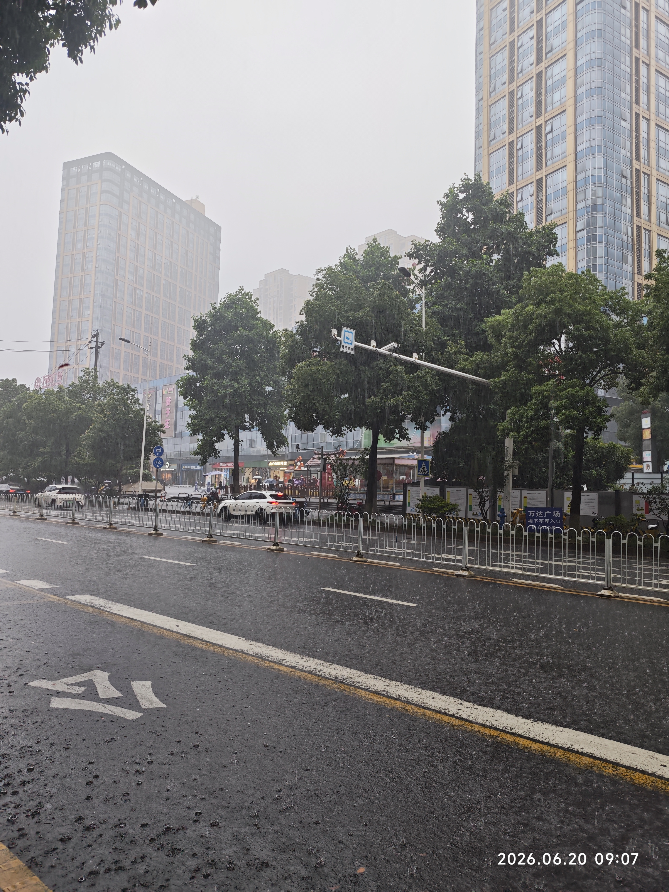

我突然发现我已经闲不下来了。  
不是因为工作或事情的忙碌，而是我难以回到那种闲的状态——无所事事的静静的呆着的状态。  
昨天我外出游玩，我在等公交车的时候发现我难以闲下来，我总要找点事，大雨下，我只能站着，感受着雨水弹射在我的脚上、腿上，雨越下越大，我感到雨水像雾像灰一样扑面而来，让我的脖子感到雨水的轻吻。我起初静静的看着不断在雨中穿梭的车辆，后来我脚痛腿酸，我时不时的看向那站满水的长凳，我不能坐下去。我愈发的难受，我不断的向前去张望，期待着公交车的到来，可没有。我不知为何就开始刷手机了，我难以在大雨中听清视频中的声音，身上的瘙痒（雨溅射到身上产生的）让我难以专注视频的画面。我不知道我为什么要刷视频，我仿佛像是在鸡蛋里挑骨头一样不断的向下滑动着屏幕，可是我不知道骨头为何存在。我一手撑伞一手滑动屏幕，雨水像鲤鱼越龙门般不断地越过我的雨伞跳到屏幕上，我不时的让大拇指离开屏幕，手指抓紧它，擦过我的左臀。继续划着屏幕伴着雨声，车声。不知多久，大抵一个小时了，我终于知道它不会在出现了，高德它骗了我，站台它骗了我。我愤怒，我难过，我沉默，我无力。我重新上路，雨水漫过我的拖鞋，凉爽舒服，我急步向高德为我规划的下一个站点奔去。我总是上了车，我总算坐下，我继续的划着屏幕……  
我晚上闭眼躺床上兀的发现我早已闲不下来了。我时常在在走路时、吃饭时玩手机，明明我不能那么专注地玩手机，可我依旧不愿放下它。我发现我难以像别人那样在那静坐几个小时，我觉得几分钟的闲都是浪费。我有时会在规定的睡觉时间想要上厕所，但我依然发下手机，我不忍让蓝光和信息再刺激我眼和脑，我的肚子咕咕叫，我的屁眼疼痛着我，我早已不再习惯上厕所时不刷手机。我忍着、痛着，在床上翻来覆去，我犹豫着。有时我战胜了它，我在疼痛减轻时睡去；有时我败了，我打破了习惯（定时睡觉的习惯），在厕所中刷上了手机。  
仔细想来我唯有在睡着前的那段时间才是闲的，我不再输入，我在反刍。好的坏的一个接一个蹦出，一下天一下地。  
闲不取决于事情的多寡，在于心态。  
